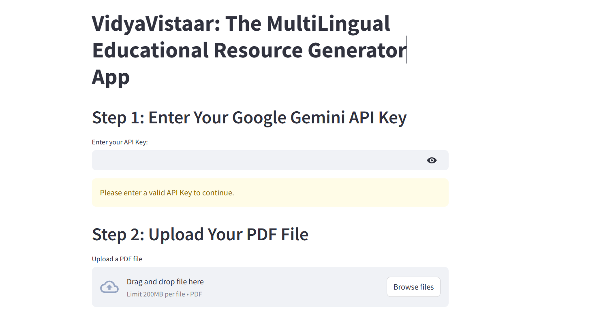
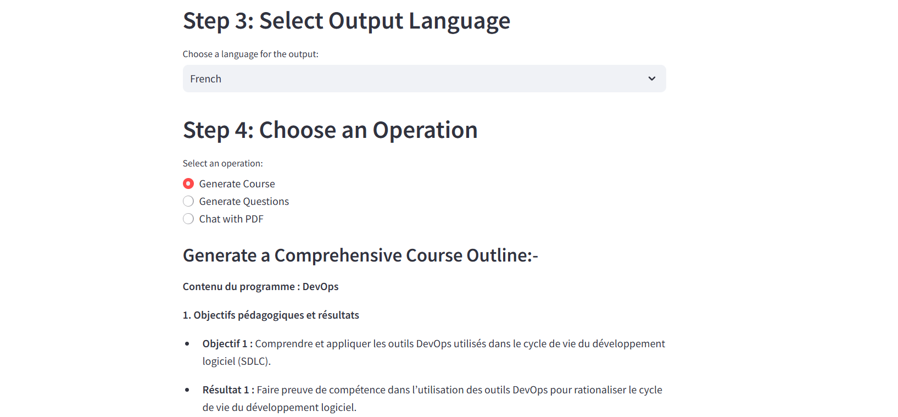

# VidyaVistaar: The MultiLingual Educational Resource Generator App

VidyaVistaar is an AI tool designed to generate educational resources, such as courses, quizzes and chatbot interactions, based on document contents in one's own preferred language. It uses advanced techniques like Retrieval-Augmented Generation (RAG), sentence embeddings for content retrieval and Google Gemini's generative AI for response generation and translation.


## Features

1. **PDF Text Extraction**: Extracts text from PDF documents.

2. **Content Chunking**: Splits extracted text into smaller chunks for efficient processing.

3. **Embedding and Retrieval**: Uses sentence embeddings to create a FAISS-based index for fast retrieval of relevant content chunks.

4. **Generative AI Responses**: Generates responses using Google Gemini's generative model for content creation, such as courses, multiple-choice questions (MCQs), and short-answer questions.

5. **Multilingual Support**: Translates generated content into multiple languages, supporting a wide range of languages.

6. **Interactive Chatbot**: Provides an interactive chatbot that allows users to ask questions and get answers based on the content in the uploaded PDF document.


## Technologies Used

1. **FAISS**: For efficient similarity search and vector-based retrieval.

2. **SentenceTransformers**: To generate sentence embeddings for chunking and retrieval.

3. **Google Gemini**: For generating responses to queries, creating educational content, and translating text.

4. **PyPDF2**: For extracting text from PDF documents.

5. **Transformers (Hugging Face)**: Used for tokenizing and encoding text for classification tasks.


## Installation

1. Clone the Repository.

2. Open Command Prompt and Docker.

3. Direct to the folder.

4. Build the Docker Image in Command Prompt.

```
docker build -t multi-education-app .
```

5. Run docker Image using Command Prompt.

```
docker run -p 8501:8501 multi-education-app
```

6. The app will run on  http://localhost:8501

7. Enter the Google Gemini API Key.

8. Upload the PDF, then select Desired Language and Desired Functionality.


## Screenshots

Below are screenshots of the application:

### 1. Opening Page



This is the first view of the page that appears when the application loads and user enters the Google Gemini API Key which gets verified and then user can enter a PDF.

### 2. Multilingual Output



Here, the content appears in user's desired language from the list mentioned.


## Functionality

1. **Chatbot Interaction**:

- Upload a PDF document.

- The AI will analyze the document and store its content in a FAISS index.

- You can ask questions about the content, and the chatbot will use Retrieval-Augmented Generation (RAG) to generate accurate responses.

2. **Generate Course**:

- Generates a structured course outline based on the document's content.

- Includes learning objectives, key concepts and detailed topic descriptions.

3. **Generate Questions**:

- Generates multiple-choice questions (MCQs), fill-in-the-blank questions,and short-answer questions based on the content.

- You can specify the number of questions to generate (5, 10, 15).

4. **Multilingual Support**:

- Translates the generated responses (such as courses, questions, and answers) into various languages, including Arabic, Spanish, French, German and more.


## Acknowledgments

1. **Google Gemini AI**: For providing the generative models used in this project.

2. **SentenceTransformers**: For providing high-quality pre-trained models for sentence embeddings.

3. **FAISS**: For enabling efficient similarity search using embeddings.


## Contributions 

Contributions are welcome! If you'd like to help improve this project, please fork the repository and submit a pull request.